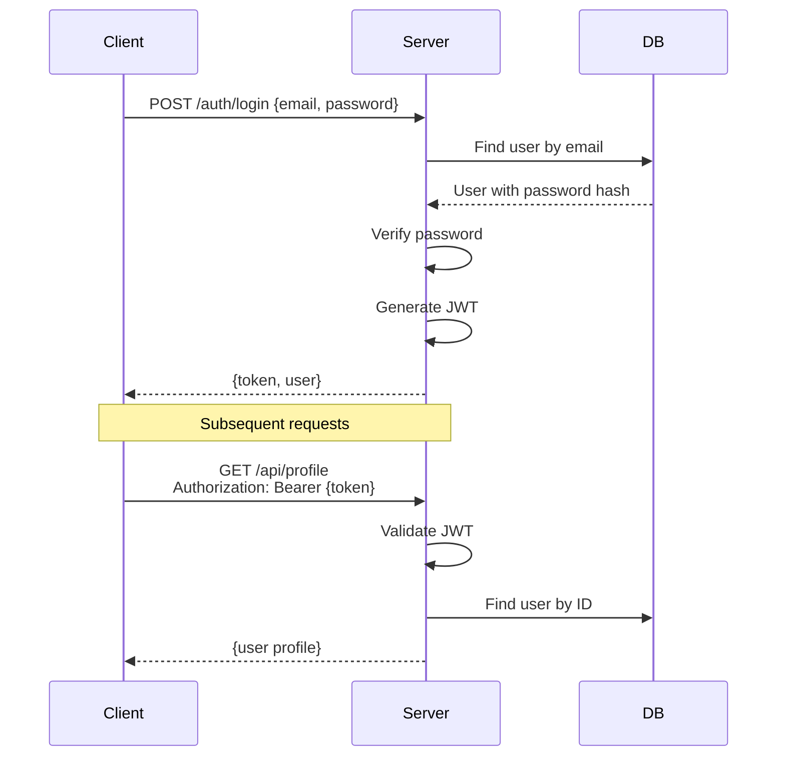

import { Accordion, Accordions } from 'fumadocs-ui/components/accordion';
import { Callout } from 'fumadocs-ui/components/callout';
import { Tab, Tabs } from 'fumadocs-ui/components/tabs';

# Authentication

Implement authentication patterns with Axiom middleware.

## Simple Token Authentication

Basic auth middleware that validates Bearer tokens:

```java
app.use((ctx, next) -> {
    String path = ctx.path();

    // Skip auth for public paths
    if (path.startsWith("/health") || path.startsWith("/auth/login")) {
        next.run();
        return;
    }

    // Check Authorization header
    String authHeader = ctx.header("Authorization");
    if (authHeader == null || !authHeader.startsWith("Bearer ")) {
        ctx.status(401);
        ctx.json(Map.of("error", "Missing or invalid Authorization header"));
        return;
    }

    String token = authHeader.substring(7);
    Optional<User> userOpt = authService.validateToken(token);

    if (userOpt.isEmpty()) {
        ctx.status(401);
        ctx.json(Map.of("error", "Invalid or expired token"));
        return;
    }

    // Store user in context for handlers
    ctx.set("user", userOpt.get());
    ctx.set("userId", userOpt.get().id());

    next.run();
});
```

Access authenticated user in handlers:

```java
router.get("/api/profile", ctx -> {
    User user = ctx.get("user", User.class)
        .orElseThrow(() -> new UnauthorizedException());
    ctx.json(user);
});
```

---

## JWT Authentication

<Accordions>
  <Accordion title="JwtService.java">
```java
import io.jsonwebtoken.*;
import io.jsonwebtoken.security.Keys;
import javax.crypto.SecretKey;
import java.util.Date;

@Service
public class JwtService {

    private final SecretKey key;
    private final long expirationMs = 3600_000; // 1 hour

    public JwtService() {
        String secret = System.getenv("JWT_SECRET");
        this.key = Keys.hmacShaKeyFor(secret.getBytes());
    }

    public String generateToken(User user) {
        return Jwts.builder()
            .subject(String.valueOf(user.id()))
            .claim("email", user.email())
            .claim("role", user.role())
            .issuedAt(new Date())
            .expiration(new Date(System.currentTimeMillis() + expirationMs))
            .signWith(key)
            .compact();
    }

    public Optional<Claims> validateToken(String token) {
        try {
            Claims claims = Jwts.parser()
                .verifyWith(key)
                .build()
                .parseSignedClaims(token)
                .getPayload();
            return Optional.of(claims);
        } catch (JwtException e) {
            return Optional.empty();
        }
    }
}
```
  </Accordion>

  <Accordion title="JwtAuthMiddleware.java">
```java
import io.axiom.di.Middleware;
import io.axiom.core.middleware.MiddlewareHandler;
import io.jsonwebtoken.Claims;
import jakarta.inject.Inject;
import java.util.Set;

@Middleware(order = 10)
public class JwtAuthMiddleware implements MiddlewareHandler {

    private static final Set<String> PUBLIC_PATHS = Set.of(
        "/health",
        "/auth/login",
        "/auth/register"
    );

    private final JwtService jwtService;
    private final UserRepository userRepository;

    @Inject
    public JwtAuthMiddleware(JwtService jwtService, UserRepository userRepository) {
        this.jwtService = jwtService;
        this.userRepository = userRepository;
    }

    @Override
    public void handle(Context ctx, Next next) throws Exception {
        if (isPublicPath(ctx.path())) {
            next.run();
            return;
        }

        String token = extractToken(ctx.header("Authorization"));
        if (token == null) {
            unauthorized(ctx, "Missing authorization header");
            return;
        }

        Optional<Claims> claimsOpt = jwtService.validateToken(token);
        if (claimsOpt.isEmpty()) {
            unauthorized(ctx, "Invalid or expired token");
            return;
        }

        Claims claims = claimsOpt.get();
        long userId = Long.parseLong(claims.getSubject());

        Optional<User> userOpt = userRepository.findById(userId);
        if (userOpt.isEmpty()) {
            unauthorized(ctx, "User not found");
            return;
        }

        // Store in context
        ctx.set("user", userOpt.get());
        ctx.set("userId", userId);
        ctx.set("userRole", claims.get("role", String.class));

        next.run();
    }

    private boolean isPublicPath(String path) {
        return PUBLIC_PATHS.stream().anyMatch(path::startsWith);
    }

    private String extractToken(String header) {
        if (header == null || !header.startsWith("Bearer ")) {
            return null;
        }
        return header.substring(7);
    }

    private void unauthorized(Context ctx, String message) {
        ctx.status(401);
        ctx.json(Map.of("error", message));
    }
}
```
  </Accordion>
</Accordions>

---

## Login & Register Routes

<Tabs items={['AuthRoutes.java', 'AuthService.java']}>
  <Tab value="AuthRoutes.java">
```java
import io.axiom.di.Routes;
import io.axiom.validation.AxiomValidator;
import jakarta.inject.Inject;

@Routes("/auth")
public class AuthRoutes {

    private final AuthService authService;

    @Inject
    public AuthRoutes(AuthService authService) {
        this.authService = authService;
    }

    public Router router() {
        var r = new Router();

        // POST /auth/login
        r.post("/login", ctx -> {
            var request = AxiomValidator.validateOrThrow(
                ctx.body(LoginRequest.class)
            );

            var result = authService.authenticate(
                request.email(),
                request.password()
            );

            switch (result) {
                case AuthResult.Success s -> {
                    ctx.json(Map.of(
                        "token", s.token(),
                        "expiresIn", 3600,
                        "user", s.user().toResponse()
                    ));
                }
                case AuthResult.InvalidCredentials ic -> {
                    ctx.status(401);
                    ctx.json(Map.of("error", "Invalid credentials"));
                }
            }
        });

        // POST /auth/register
        r.post("/register", ctx -> {
            var request = AxiomValidator.validateOrThrow(
                ctx.body(RegisterRequest.class)
            );

            var result = authService.register(request);

            switch (result) {
                case AuthResult.Success s -> {
                    ctx.status(201);
                    ctx.json(Map.of(
                        "token", s.token(),
                        "user", s.user().toResponse()
                    ));
                }
                case AuthResult.EmailExists ee -> {
                    ctx.status(409);
                    ctx.json(Map.of("error", "Email already registered"));
                }
            }
        });

        // GET /auth/me (requires auth)
        r.get("/me", ctx -> {
            User user = ctx.get("user", User.class)
                .orElseThrow(() -> new UnauthorizedException());
            ctx.json(user.toResponse());
        });

        // POST /auth/logout
        r.post("/logout", ctx -> {
            // Token invalidation (if using blacklist)
            String token = extractToken(ctx.header("Authorization"));
            if (token != null) {
                authService.revokeToken(token);
            }
            ctx.status(204);
            ctx.text("");
        });

        return r;
    }
}

record LoginRequest(
    @NotBlank @Email String email,
    @NotBlank String password
) {}

record RegisterRequest(
    @NotBlank @Size(min = 2, max = 100) String name,
    @NotBlank @Email String email,
    @NotBlank @Size(min = 8) String password
) {}
```
  </Tab>
  <Tab value="AuthService.java">
```java
import io.axiom.di.Service;
import jakarta.inject.Inject;

@Service
public class AuthService {

    private final UserRepository userRepository;
    private final JwtService jwtService;
    private final PasswordService passwordService;

    @Inject
    public AuthService(
        UserRepository userRepository,
        JwtService jwtService,
        PasswordService passwordService
    ) {
        this.userRepository = userRepository;
        this.jwtService = jwtService;
        this.passwordService = passwordService;
    }

    public AuthResult authenticate(String email, String password) {
        return userRepository.findByEmail(email)
            .filter(user -> passwordService.verify(password, user.passwordHash()))
            .map(user -> {
                String token = jwtService.generateToken(user);
                return (AuthResult) new AuthResult.Success(token, user);
            })
            .orElse(new AuthResult.InvalidCredentials());
    }

    public AuthResult register(RegisterRequest request) {
        if (userRepository.existsByEmail(request.email())) {
            return new AuthResult.EmailExists();
        }

        String hash = passwordService.hash(request.password());
        User user = userRepository.create(request.name(), request.email(), hash);
        String token = jwtService.generateToken(user);

        return new AuthResult.Success(token, user);
    }

    public void revokeToken(String token) {
        tokenBlacklist.add(token);
    }
}

// Sealed result type for exhaustive handling
sealed interface AuthResult {
    record Success(String token, User user) implements AuthResult {}
    record InvalidCredentials() implements AuthResult {}
    record EmailExists() implements AuthResult {}
}
```
  </Tab>
</Tabs>

---

## Password Hashing

Use BCrypt for secure password hashing:

```java
import at.favre.lib.crypto.bcrypt.BCrypt;

@Service
public class PasswordService {

    private static final int COST = 12;

    public String hash(String password) {
        return BCrypt.withDefaults()
            .hashToString(COST, password.toCharArray());
    }

    public boolean verify(String password, String hash) {
        return BCrypt.verifyer()
            .verify(password.toCharArray(), hash)
            .verified;
    }
}
```

<Callout type="warn">
**Never store plain text passwords.** Always hash with BCrypt, Argon2, or scrypt.
</Callout>

---

## Role-Based Access Control

Create middleware for role checking:

<Tabs items={['Role Middleware', 'Usage']}>
  <Tab value="Role Middleware">
```java
public class RoleMiddleware {

    public static MiddlewareHandler requireRole(String... roles) {
        Set<String> allowedRoles = Set.of(roles);

        return (ctx, next) -> {
            String userRole = ctx.get("userRole", String.class).orElse("");

            if (!allowedRoles.contains(userRole)) {
                ctx.status(403);
                ctx.json(Map.of("error", "Insufficient permissions"));
                return;
            }

            next.run();
        };
    }

    public static MiddlewareHandler requireAdmin() {
        return requireRole("admin");
    }

    public static MiddlewareHandler requireModerator() {
        return requireRole("admin", "moderator");
    }
}
```
  </Tab>
  <Tab value="Usage">
```java
// Admin-only routes
Router adminRouter = new Router();
adminRouter.use(RoleMiddleware.requireAdmin());
adminRouter.get("/stats", ctx -> { /* admin only */ });
adminRouter.delete("/users/:id", ctx -> { /* admin only */ });

app.route("/admin", adminRouter);

// Editor or Admin routes
Router contentRouter = new Router();
contentRouter.use(RoleMiddleware.requireRole("admin", "editor"));
contentRouter.post("/articles", ctx -> { /* create */ });
contentRouter.put("/articles/:id", ctx -> { /* update */ });

app.route("/content", contentRouter);
```
  </Tab>
</Tabs>

---

## Refresh Token Pattern

For long-lived sessions with short-lived access tokens:

<Accordions>
  <Accordion title="Token Service">
```java
@Service
public class TokenService {

    private final Map<String, RefreshToken> refreshTokens = new ConcurrentHashMap<>();

    public TokenPair generateTokenPair(User user) {
        String accessToken = generateAccessToken(user);   // 15 min
        String refreshToken = generateRefreshToken(user); // 7 days

        refreshTokens.put(refreshToken, new RefreshToken(
            user.id(),
            System.currentTimeMillis()
        ));

        return new TokenPair(accessToken, refreshToken);
    }

    public Optional<TokenPair> refreshTokens(String refreshToken) {
        RefreshToken stored = refreshTokens.get(refreshToken);

        if (stored == null || stored.isExpired()) {
            refreshTokens.remove(refreshToken);
            return Optional.empty();
        }

        // Rotate: invalidate old, create new
        refreshTokens.remove(refreshToken);

        User user = userRepository.findById(stored.userId()).orElseThrow();
        return Optional.of(generateTokenPair(user));
    }

    record RefreshToken(long userId, long createdAt) {
        boolean isExpired() {
            long sevenDays = 7 * 24 * 60 * 60 * 1000L;
            return System.currentTimeMillis() - createdAt > sevenDays;
        }
    }

    record TokenPair(String accessToken, String refreshToken) {}
}
```
  </Accordion>

  <Accordion title="Refresh Endpoint">
```java
// POST /auth/refresh
r.post("/refresh", ctx -> {
    var request = ctx.body(RefreshRequest.class);

    tokenService.refreshTokens(request.refreshToken())
        .ifPresentOrElse(
            pair -> ctx.json(Map.of(
                "accessToken", pair.accessToken(),
                "refreshToken", pair.refreshToken()
            )),
            () -> {
                ctx.status(401);
                ctx.json(Map.of("error", "Invalid refresh token"));
            }
        );
});

record RefreshRequest(String refreshToken) {}
```
  </Accordion>
</Accordions>

---

## Path-Based Auth Rules

Configure different auth requirements per path:

```java
@Middleware(order = 10)
public class AuthMiddleware implements MiddlewareHandler {

    private record PathRule(String pattern, boolean requireAuth, Set<String> roles) {}

    private static final List<PathRule> RULES = List.of(
        // Public paths
        new PathRule("/health/**", false, Set.of()),
        new PathRule("/auth/login", false, Set.of()),
        new PathRule("/auth/register", false, Set.of()),

        // Authenticated paths
        new PathRule("/api/**", true, Set.of()),

        // Admin paths
        new PathRule("/admin/**", true, Set.of("admin"))
    );

    @Override
    public void handle(Context ctx, Next next) throws Exception {
        PathRule rule = findMatchingRule(ctx.path());

        if (!rule.requireAuth()) {
            next.run();
            return;
        }

        // Validate auth...
        String token = extractToken(ctx);
        User user = validateToken(token);
        ctx.set("user", user);

        // Check role if required
        if (!rule.roles().isEmpty() && !rule.roles().contains(user.role())) {
            ctx.status(403);
            ctx.json(Map.of("error", "Insufficient permissions"));
            return;
        }

        next.run();
    }
}
```

---

## Complete Auth Flow



---

## Security Best Practices

<Callout type="warn" title="Security Checklist">
1. **Use HTTPS** in production
2. **Hash passwords** with BCrypt/Argon2 (cost ≥ 12)
3. **Short-lived tokens** (15 min access, 7 day refresh)
4. **Rotate refresh tokens** on use
5. **Validate all inputs** before processing
6. **Log auth failures** for monitoring
7. **Rate limit** login attempts
8. **Never log tokens or passwords**
</Callout>
