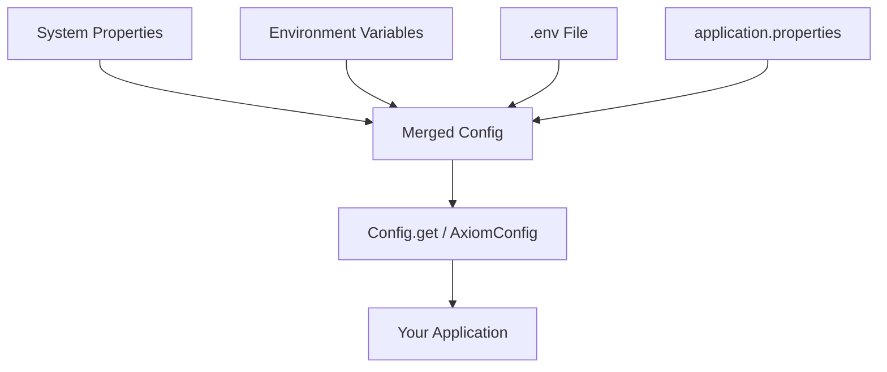

import { Callout } from 'fumadocs-ui/components/callout';
import { Tab, Tabs } from 'fumadocs-ui/components/tabs';

# Configuration

Axiom provides zero-headache configuration.

## Zero Config Start

You don't need any config files to start:

```java
Router router = new Router();
router.get("/", c -> c.text("Hello!"));
Axiom.start(router, 8080);
```

<Callout type="info">
This is the **entire** application. No `application.properties`, no `application.yml`, no XML.
</Callout>

## Two Configuration APIs

Axiom provides two ways to access configuration:

<Tabs items={['Static Config (Simple)', 'AxiomConfig (Advanced)']}>
  <Tab value="Static Config (Simple)">
For most apps, use the static `Config` class:

```java
import io.axiom.config.Config;

// Get values with defaults
int port = Config.get("server.port", 8080);
String host = Config.get("server.host", "localhost");
boolean debug = Config.get("app.debug", false);

// Required values (throws if missing)
String dbUrl = Config.get("database.url");

// Optional values
Optional<String> apiKey = Config.getOptional("api.key");
```
  </Tab>
  <Tab value="AxiomConfig (Advanced)">
For more control, use `AxiomConfig`:

```java
import io.axiom.config.AxiomConfig;

// Load default configuration
AxiomConfig config = AxiomConfig.load();

// Get values with Optional
int port = config.getInt("server.port").orElse(8080);
String host = config.get("server.host").orElse("localhost");
Duration timeout = config.getDuration("server.timeout").orElse(Duration.ofSeconds(30));

// Required values
String dbUrl = config.require("database.url");
int poolSize = config.requireInt("database.poolSize");
```
  </Tab>
</Tabs>

## Configuration Sources

Config values are loaded from (highest priority first):

| Priority | Source | Example |
|----------|--------|---------|
| 1 | System properties | `-Dserver.port=9090` |
| 2 | Environment variables | `SERVER_PORT=9090` |
| 3 | `.env` file | `SERVER_PORT=9090` |
| 4 | `application-{profile}.properties` | Profile-specific |
| 5 | `application.properties` | `server.port=9090` |

### Environment Variable Mapping

Environment variables are automatically mapped:

| Env Variable | Property Key |
|--------------|--------------|
| `SERVER_PORT` | `server.port` |
| `DATABASE_URL` | `database.url` |
| `MY_APP_DEBUG` | `my.app.debug` |

## .env File

Create a `.env` file in your project root:

```bash title=".env"
# Database
DATABASE_URL=postgres://localhost/myapp
DATABASE_POOL_SIZE=10

# Security
SECRET_KEY=your-secret-key

# Debug
DEBUG=true
```

<Callout type="warn">
Never commit `.env` files with secrets to version control. Add `.env` to your `.gitignore`.
</Callout>

## application.properties

Create `src/main/resources/application.properties`:

```properties title="application.properties"
server.port=8080
server.host=localhost

database.url=jdbc:postgresql://localhost/myapp
database.poolSize=10

app.name=My Axiom App
```

## Binding to Records

Bind configuration to Java records for type-safety:

```java
import io.axiom.config.Config;

// Define your config record
record DatabaseConfig(String url, String username, String password) {}

// Bind to record (reads database.url, database.username, database.password)
DatabaseConfig db = Config.bind("database", DatabaseConfig.class);

System.out.println(db.url());      // jdbc:postgresql://localhost/myapp
System.out.println(db.username()); // myuser
```

## Pre-built Config Records

Axiom provides ready-to-use configuration records:

```java
import io.axiom.config.Config;

// Server config (reads server.host, server.port, server.contextPath)
Config.ServerConfig server = Config.server();
app.listen(server.host(), server.port());

// Database config (reads database.url, database.username, etc.)
Config.DatabaseConfig db = Config.database();
System.out.println(db.url());
```

## Type-Safe Config with Interfaces

For complex apps, use SmallRye ConfigMapping:

```java
import io.smallrye.config.ConfigMapping;
import io.smallrye.config.WithDefault;
import java.time.Duration;
import java.util.Optional;

@ConfigMapping(prefix = "server")
interface ServerConfig {
    String host();

    @WithDefault("8080")
    int port();

    @WithDefault("30s")
    Duration timeout();

    Optional<String> contextPath();
}

// Usage
AxiomConfig config = AxiomConfig.builder()
    .withMapping(ServerConfig.class)
    .build();

ServerConfig server = config.getMapping(ServerConfig.class);
System.out.println(server.port());    // 8080
System.out.println(server.timeout()); // PT30S
```

## Duration Formats

Duration values support human-readable formats:

| Format | Example | Duration |
|--------|---------|----------|
| Milliseconds | `500ms` | 500 milliseconds |
| Seconds | `30s` | 30 seconds |
| Minutes | `5m` | 5 minutes |
| Hours | `2h` | 2 hours |
| Days | `1d` | 1 day |
| ISO-8601 | `PT30S` | 30 seconds |

```java
Duration timeout = config.getDuration("server.timeout").orElse(Duration.ofSeconds(30));
Duration cacheExpiry = config.getDuration("cache.ttl", Duration.ofMinutes(5));
```

## Profile-Specific Config

Load different configs per environment:

<Tabs items={['Default', 'Production', 'Development']}>
  <Tab value="Default">
```properties title="application.properties"
database.url=jdbc:h2:mem:test
server.port=8080
```
  </Tab>
  <Tab value="Production">
```properties title="application-prod.properties"
database.url=jdbc:postgresql://prod-server/myapp
server.port=80
```
  </Tab>
  <Tab value="Development">
```properties title="application-dev.properties"
database.url=jdbc:postgresql://localhost/myapp_dev
server.port=8080
app.debug=true
```
  </Tab>
</Tabs>

Activate profiles:

```java
AxiomConfig config = AxiomConfig.builder()
    .withProfiles("prod")
    .build();
```

Or via system property:
```bash
java -Dprofile=prod -jar app.jar
```

## Configuration Subsets

Extract a subset of configuration by prefix:

```java
// Original config:
// database.url=jdbc:postgresql://localhost/app
// database.pool.size=10
// server.port=8080

AxiomConfig dbConfig = config.subset("database");
// Now contains:
// url=jdbc:postgresql://localhost/app
// pool.size=10

String url = dbConfig.get("url").orElseThrow();
```

## Custom Configuration Builder

```java
AxiomConfig config = AxiomConfig.builder()
    .withProperty("server.port", "9090")
    .withProperties(Map.of(
        "database.url", "jdbc:h2:mem:test",
        "database.poolSize", "5"
    ))
    .withPropertiesFile(Path.of("custom.properties"))
    .withDotEnvFile(Path.of(".env.local"))
    .withMapping(ServerConfig.class)
    .build();
```

## Parsing Inline Configuration

For testing or quick setup:

```java
AxiomConfig config = AxiomConfig.parse("""
    server.port=8080
    server.host=localhost
    database.url=jdbc:h2:mem:test
    """);

int port = config.getInt("server.port").orElse(8080);
```

## Configuration Flow


