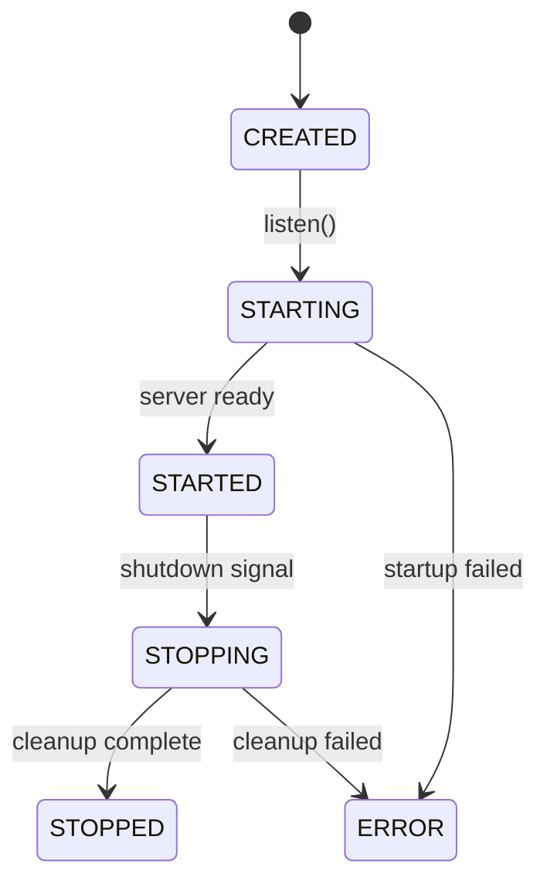

import { Accordion, Accordions } from 'fumadocs-ui/components/accordion';
import { Callout } from 'fumadocs-ui/components/callout';
import { Tab, Tabs } from 'fumadocs-ui/components/tabs';

# Lifecycle

Axiom provides hooks for application startup, readiness, and shutdown.

## Lifecycle Phases



| Phase | Description |
|-------|-------------|
| `CREATED` | App instance created, not yet started |
| `STARTING` | `listen()` called, running `onStart` hooks |
| `STARTED` | Server accepting requests, `onReady` hooks run |
| `STOPPING` | Shutdown initiated, running `onShutdown` hooks |
| `STOPPED` | All cleanup complete |
| `ERROR` | Lifecycle error occurred |

---

## Lifecycle Hooks

### onStart

Runs during `STARTING` phase, **before** accepting requests:

```java
App app = Axiom.create();

app.onStart(() -> {
    System.out.println("Connecting to database...");
    AxiomPersistence.start();
});

app.onStart(() -> {
    System.out.println("Loading cache...");
    cache.warmUp();
});

app.listen(8080);
```

<Callout type="info">
Multiple `onStart` hooks run in **registration order**.
</Callout>

### onReady

Runs after `STARTED`, when server is ready to accept requests:

```java
app.onReady(() -> {
    System.out.println("🚀 Server ready at http://localhost:8080");
});

app.onReady(() -> {
    healthCheck.markReady();
    metrics.recordStartup();
});
```

### onShutdown

Runs during `STOPPING` phase, in **reverse registration order**:

```java
app.onShutdown(() -> {
    System.out.println("Closing database connections...");
    AxiomPersistence.stop();
});

app.onShutdown(() -> {
    System.out.println("Flushing metrics...");
    metrics.flush();
});
```

<Callout type="warn">
Shutdown hooks run in **reverse order** (LIFO). Last registered runs first.
</Callout>

### onLifecycleError

Runs when an error occurs during lifecycle transitions:

```java
app.onLifecycleError(error -> {
    System.err.println("Lifecycle error: " + error.getMessage());
    alerting.sendCritical("Server lifecycle failure", error);
});
```

---

## Complete Example

```java title="App.java"
import io.axiom.core.app.*;
import io.axiom.core.routing.Router;
import io.axiom.persistence.AxiomPersistence;

public class App {
    public static void main(String[] args) {
        Router router = new Router();
        router.get("/health", ctx -> ctx.json(Map.of("status", "ok")));
        router.get("/users", ctx -> ctx.json(userService.findAll()));

        App app = Axiom.create();

        // Startup hooks (run in order)
        app.onStart(() -> {
            System.out.println("📦 Starting persistence...");
            AxiomPersistence.start();
        });

        app.onStart(() -> {
            System.out.println("🔥 Warming cache...");
            cacheService.warmUp();
        });

        // Ready hook
        app.onReady(() -> {
            System.out.println("🚀 Server ready at http://localhost:8080");
            System.out.println("   Health: http://localhost:8080/health");
        });

        // Shutdown hooks (run in reverse order)
        app.onShutdown(() -> {
            System.out.println("💾 Flushing cache...");
            cacheService.flush();
        });

        app.onShutdown(() -> {
            System.out.println("📦 Closing persistence...");
            AxiomPersistence.stop();
        });

        // Error handling
        app.onLifecycleError(error -> {
            System.err.println("❌ Lifecycle error: " + error.getMessage());
            error.printStackTrace();
        });

        app.route(router);
        app.listen(8080);
    }
}
```

**Output on startup:**
```
📦 Starting persistence...
🔥 Warming cache...
🚀 Server ready at http://localhost:8080
   Health: http://localhost:8080/health
```

**Output on shutdown (Ctrl+C):**
```
📦 Closing persistence...
💾 Flushing cache...
```

---

## Graceful Shutdown

Axiom handles `SIGTERM` and `SIGINT` signals for graceful shutdown:

```java
app.onShutdown(() -> {
    // 1. Stop accepting new requests
    // 2. Wait for in-flight requests to complete
    // 3. Run your cleanup code
    database.close();
});
```

### Shutdown Timeout

Configure maximum time for graceful shutdown:

```java
App app = Axiom.create();
app.shutdownTimeout(Duration.ofSeconds(30));  // Wait up to 30s
```

---

## Hook Use Cases

<Accordions>
  <Accordion title="Database Connection">
```java
app.onStart(() -> {
    AxiomPersistence.start();
});

app.onShutdown(() -> {
    AxiomPersistence.stop();
});
```
  </Accordion>

  <Accordion title="Cache Warming">
```java
app.onStart(() -> {
    // Pre-load frequently accessed data
    cache.put("config", configService.loadAll());
    cache.put("countries", countryService.findAll());
});

app.onShutdown(() -> {
    cache.flush();
});
```
  </Accordion>

  <Accordion title="Health Check Integration">
```java
private static volatile boolean ready = false;

app.onReady(() -> {
    ready = true;
});

router.get("/health/ready", ctx -> {
    if (ready) {
        ctx.json(Map.of("status", "ready"));
    } else {
        ctx.status(503);
        ctx.json(Map.of("status", "starting"));
    }
});
```
  </Accordion>

  <Accordion title="Metrics & Monitoring">
```java
app.onReady(() -> {
    metrics.recordGauge("app.startup.time", startupTime);
    metrics.recordEvent("app.started");
});

app.onShutdown(() -> {
    metrics.flush();
    metrics.close();
});
```
  </Accordion>

  <Accordion title="Background Jobs">
```java
private ScheduledExecutorService scheduler;

app.onStart(() -> {
    scheduler = Executors.newScheduledThreadPool(2);
    scheduler.scheduleAtFixedRate(
        this::cleanupExpiredTokens,
        0, 1, TimeUnit.HOURS
    );
});

app.onShutdown(() -> {
    scheduler.shutdown();
    scheduler.awaitTermination(10, TimeUnit.SECONDS);
});
```
  </Accordion>

  <Accordion title="External Service Registration">
```java
app.onReady(() -> {
    // Register with service discovery
    serviceRegistry.register("my-service", "localhost", 8080);
});

app.onShutdown(() -> {
    // Deregister before shutdown
    serviceRegistry.deregister("my-service");
});
```
  </Accordion>
</Accordions>

---

## Before & After Hooks

For per-request hooks (not lifecycle), use `before()` and `after()`:

```java
// Runs after middleware, before route handler
app.before(ctx -> {
    ctx.set("startTime", System.nanoTime());
});

// Runs after route handler completes
app.after(ctx -> {
    long start = ctx.get("startTime", Long.class).orElse(0L);
    long duration = System.nanoTime() - start;
    metrics.record("request.duration", duration);
});
```

<Callout type="info">
Unlike middleware, `before()` and `after()` hooks **cannot short-circuit** the request chain.
</Callout>

---

## Lifecycle vs Request Hooks

| Hook | Scope | Can Short-Circuit? | Use Case |
|------|-------|-------------------|----------|
| `onStart` | App startup | N/A | Initialize resources |
| `onReady` | App ready | N/A | Announce readiness |
| `onShutdown` | App shutdown | N/A | Cleanup resources |
| `before` | Per-request | No | Pre-processing |
| `after` | Per-request | No | Post-processing |
| `use` (middleware) | Per-request | Yes | Auth, logging, CORS |

---

## Error Handling During Lifecycle

If a hook throws an exception:

```java
app.onStart(() -> {
    throw new RuntimeException("Database unavailable");
});

app.onLifecycleError(error -> {
    // This is called with the exception
    System.err.println("Startup failed: " + error.getMessage());
    System.exit(1);
});
```

The application transitions to `ERROR` state and `onLifecycleError` hooks are invoked.
