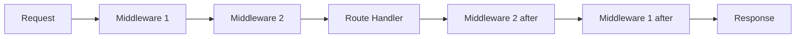

import { Callout } from 'fumadocs-ui/components/callout';
import { Tab, Tabs } from 'fumadocs-ui/components/tabs';

# Middleware

Middleware functions run before your route handlers. Use them for logging, authentication, CORS, and more.

## Two Middleware Styles

Axiom supports **two middleware styles** — use whichever fits your mental model:

<Tabs items={['Explicit Next (ctx, next)', 'Context Next (ctx.next())']}>
  <Tab value="Explicit Next (ctx, next)">
The `MiddlewareHandler` interface takes both context and next as parameters:

```java
app.use((ctx, next) -> {
    System.out.println("Request: " + ctx.method() + " " + ctx.path());
    next.run();
    System.out.println("Response sent");
});
```

**Use when:** You want explicit control over the `next` function.
  </Tab>
  <Tab value="Context Next (ctx.next())">
The `SimpleMiddleware` interface embeds next in the context:

```java
app.use(ctx -> {
    System.out.println("Request: " + ctx.method() + " " + ctx.path());
    ctx.next();
    System.out.println("Response sent");
});
```

**Use when:** You prefer cleaner single-parameter lambdas.
  </Tab>
</Tabs>

Both styles are first-class and produce **identical behavior**.

## Middleware Flow



## Logging Middleware

<Tabs items={['Explicit Next', 'Context Next']}>
  <Tab value="Explicit Next">
```java
app.use((ctx, next) -> {
    long start = System.nanoTime();
    System.out.println("--> " + ctx.method() + " " + ctx.path());

    try {
        next.run();
    } finally {
        long elapsed = (System.nanoTime() - start) / 1_000_000;
        System.out.println("<-- " + ctx.path() + " (" + elapsed + "ms)");
    }
});
```
  </Tab>
  <Tab value="Context Next">
```java
app.use(ctx -> {
    long start = System.nanoTime();
    System.out.println("--> " + ctx.method() + " " + ctx.path());

    try {
        ctx.next();
    } finally {
        long elapsed = (System.nanoTime() - start) / 1_000_000;
        System.out.println("<-- " + ctx.path() + " (" + elapsed + "ms)");
    }
});
```
  </Tab>
</Tabs>

## Authentication Middleware

<Tabs items={['Explicit Next', 'Context Next']}>
  <Tab value="Explicit Next">
```java
app.use((ctx, next) -> {
    String token = ctx.header("Authorization");
    if (token == null || !token.startsWith("Bearer ")) {
        ctx.status(401);
        ctx.json(Map.of("error", "Missing token"));
        return; // Short-circuit - don't call next
    }

    String jwt = token.substring(7);
    User user = authService.validateToken(jwt);
    if (user == null) {
        ctx.status(401);
        ctx.json(Map.of("error", "Invalid token"));
        return;
    }

    // Store user for handlers to access
    ctx.set("user", user);
    next.run();
});
```
  </Tab>
  <Tab value="Context Next">
```java
app.use(ctx -> {
    String token = ctx.header("Authorization");
    if (token == null || !token.startsWith("Bearer ")) {
        ctx.status(401);
        ctx.json(Map.of("error", "Missing token"));
        return; // Short-circuit - don't call ctx.next()
    }

    String jwt = token.substring(7);
    User user = authService.validateToken(jwt);
    if (user == null) {
        ctx.status(401);
        ctx.json(Map.of("error", "Invalid token"));
        return;
    }

    // Store user for handlers to access
    ctx.set("user", user);
    ctx.next();
});
```
  </Tab>
</Tabs>

Access the authenticated user in handlers:

```java
router.get("/api/profile", ctx -> {
    User user = ctx.get("user", User.class).orElseThrow();
    ctx.json(user);
});
```

## CORS Middleware

```java
app.use((ctx, next) -> {
    ctx.header("Access-Control-Allow-Origin", "*");
    ctx.header("Access-Control-Allow-Methods", "GET, POST, PUT, DELETE, OPTIONS");
    ctx.header("Access-Control-Allow-Headers", "Content-Type, Authorization");

    // Handle preflight requests
    if ("OPTIONS".equals(ctx.method())) {
        ctx.status(204);
        return;
    }

    next.run();
});
```

## Before/After Hooks

For simpler use cases, use `before()` and `after()` hooks:

```java
App app = Axiom.create();

// Runs after middleware, before route handler
app.before(ctx -> {
    System.out.println("Before handler: " + ctx.path());
});

// Runs after route handler completes
app.after(ctx -> {
    System.out.println("After handler: " + ctx.path());
});
```

<Callout type="info">
Unlike middleware, `before()` and `after()` hooks cannot short-circuit the request chain.
</Callout>

## Router-Level Middleware

Apply middleware to specific routers only:

```java
Router apiRouter = new Router();

// This middleware applies only to routes in apiRouter
apiRouter.use((ctx, next) -> {
    String token = ctx.header("Authorization");
    if (token == null) {
        ctx.status(401);
        ctx.json(Map.of("error", "Unauthorized"));
        return;
    }
    next.run();
});

apiRouter.get("/me", ctx -> ctx.json(getCurrentUser()));
apiRouter.get("/settings", ctx -> ctx.json(getSettings()));

// Public routes don't have the middleware
Router publicRouter = new Router();
publicRouter.get("/health", ctx -> ctx.text("OK"));

App app = Axiom.create();
app.route(publicRouter);
app.route("/api", apiRouter);
app.listen(8080);
```

## Error Handling

Use `app.onError()` to handle exceptions globally:

```java
app.onError((ctx, e) -> {
    if (e instanceof NotFoundException) {
        ctx.status(404);
        ctx.json(Map.of("error", e.getMessage()));
    } else if (e instanceof ValidationException ve) {
        ctx.status(400);
        ctx.json(Map.of(
            "error", "Validation Failed",
            "details", ve.getErrors()
        ));
    } else {
        ctx.status(500);
        ctx.json(Map.of(
            "error", "Internal Server Error",
            "message", e.getMessage()
        ));
    }
});
```

## Lifecycle Hooks

Axiom provides lifecycle hooks for startup and shutdown:

```java
App app = Axiom.create();

// Runs during STARTING phase, before accepting requests
app.onStart(() -> {
    System.out.println("Connecting to database...");
    database.connect();
});

// Runs after STARTED, when server is ready
app.onReady(() -> {
    System.out.println("🚀 Server ready at http://localhost:8080");
});

// Runs during STOPPING phase (reverse order)
app.onShutdown(() -> {
    System.out.println("Closing database connection...");
    database.close();
});

// Runs when ERROR state is entered
app.onLifecycleError(e -> {
    System.err.println("Server failed: " + e.getMessage());
    alerting.send("Server down!");
});

app.route(router);
app.listen(8080);
```

## Complete Example

```java title="App.java"
import io.axiom.core.app.*;
import io.axiom.core.routing.Router;
import java.util.Map;

public class App {
    public static void main(String[] args) {
        Router router = new Router();
        router.get("/", ctx -> ctx.text("Hello!"));
        router.get("/health", ctx -> ctx.json(Map.of("status", "ok")));
        router.get("/api/me", ctx -> {
            User user = ctx.get("user", User.class).orElseThrow();
            ctx.json(user);
        });

        App app = Axiom.create();

        // Global logging (using explicit next style)
        app.use((ctx, next) -> {
            long start = System.nanoTime();
            System.out.printf("--> %s %s%n", ctx.method(), ctx.path());
            try {
                next.run();
            } finally {
                long ms = (System.nanoTime() - start) / 1_000_000;
                System.out.printf("<-- %s (%dms)%n", ctx.path(), ms);
            }
        });

        // CORS (using context-embedded next style)
        app.use(ctx -> {
            ctx.header("Access-Control-Allow-Origin", "*");
            ctx.next();
        });

        // Auth for /api routes (using explicit next style)
        app.use((ctx, next) -> {
            if (!ctx.path().startsWith("/api")) {
                next.run();
                return;
            }

            String token = ctx.header("Authorization");
            if (token == null) {
                ctx.status(401);
                ctx.json(Map.of("error", "Unauthorized"));
                return;
            }

            User user = authService.validate(token);
            ctx.set("user", user);
            next.run();
        });

        // Error handling
        app.onError((ctx, e) -> {
            ctx.status(500);
            ctx.json(Map.of("error", e.getMessage()));
        });

        // Lifecycle
        app.onReady(() -> System.out.println("🚀 Server ready!"));

        app.route(router);
        app.listen(8080);
    }
}
```
