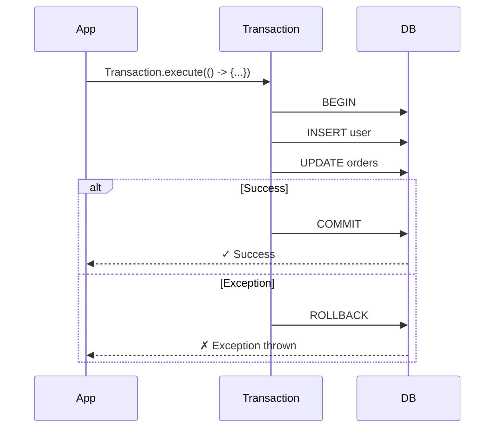

import { Callout } from 'fumadocs-ui/components/callout';
import { Step, Steps } from 'fumadocs-ui/components/steps';
import { Tab, Tabs } from 'fumadocs-ui/components/tabs';

# Persistence

Axiom Persistence provides simple, explicit database access with transactions, JDBC helpers, JPA, and jOOQ integration.

## Setup

<Steps>
  <Step>
    ### Add Dependency

    <Tabs items={['Maven', 'Gradle']}>
      <Tab value="Maven">
```xml title="pom.xml"
<dependency>
    <groupId>io.github.0xtanzim</groupId>
    <artifactId>axiom-persistence</artifactId>
    <version>0.1.1</version>
</dependency>
```
      </Tab>
      <Tab value="Gradle">
```groovy title="build.gradle"
implementation 'io.github.0xtanzim:axiom-persistence:0.1.1'
```
      </Tab>
    </Tabs>
  </Step>

  <Step>
    ### Configure Database

Create `application.properties`:

```properties title="application.properties"
database.url=jdbc:postgresql://localhost/myapp
database.username=myuser
database.password=secret
database.poolSize=10
```
  </Step>

  <Step>
    ### Start Persistence

```java
import io.axiom.persistence.AxiomPersistence;

// Start with auto-loaded configuration
AxiomPersistence.start();

// Now you can use Transaction.execute() without passing a DataSource!
```
  </Step>
</Steps>

## Quick Start

Once started, use transactions without passing a DataSource:

```java
import io.axiom.persistence.tx.Transaction;
import io.axiom.persistence.jdbc.Jdbc;

// Simple transaction
Transaction.execute(() -> {
    Jdbc.update("INSERT INTO users (name, email) VALUES (?, ?)", "John", "john@example.com");
});

// With return value
List<User> users = Transaction.execute(() -> {
    return Jdbc.query(
        "SELECT id, name, email FROM users",
        rs -> new User(rs.getLong("id"), rs.getString("name"), rs.getString("email"))
    );
});

// Shutdown when done
AxiomPersistence.stop();
```

## JDBC Operations

The `Jdbc` class provides common database operations within transactions:

### Query with Row Mapper

```java
Transaction.execute(() -> {
    // Query multiple rows
    List<User> users = Jdbc.query(
        "SELECT id, name, email FROM users WHERE active = ?",
        rs -> new User(
            rs.getLong("id"),
            rs.getString("name"),
            rs.getString("email")
        ),
        true  // parameter for active
    );
});
```

### Query Single Result

```java
Transaction.execute(() -> {
    // Optional result
    Optional<User> user = Jdbc.queryOne(
        "SELECT * FROM users WHERE id = ?",
        rs -> new User(rs.getLong("id"), rs.getString("name"), rs.getString("email")),
        userId
    );

    // Required result (throws if not found)
    User required = Jdbc.queryRequired(
        "SELECT * FROM users WHERE id = ?",
        rs -> new User(...),
        userId
    );
});
```

### Scalar Queries

```java
Transaction.execute(() -> {
    // Count
    long count = Jdbc.queryCount("SELECT COUNT(*) FROM users WHERE active = ?", true);

    // Single value
    Optional<String> name = Jdbc.queryScalar(
        "SELECT name FROM users WHERE id = ?",
        String.class,
        userId
    );
});
```

### Insert, Update, Delete

```java
Transaction.execute(() -> {
    // Update/Delete - returns affected rows
    int updated = Jdbc.update(
        "UPDATE users SET last_login = ? WHERE id = ?",
        Instant.now(), userId
    );

    // Insert with generated key
    long newId = Jdbc.insertAndReturnKey(
        "INSERT INTO users (name, email) VALUES (?, ?)",
        "John", "john@example.com"
    );

    // Batch update
    List<Object[]> batchParams = List.of(
        new Object[]{"Alice", "alice@example.com"},
        new Object[]{"Bob", "bob@example.com"}
    );
    int[] results = Jdbc.batchUpdate(
        "INSERT INTO users (name, email) VALUES (?, ?)",
        batchParams
    );
});
```

## Transaction Options

Configure transaction behavior with the builder API:

```java
import io.axiom.persistence.tx.IsolationLevel;

// Read-only transaction with custom isolation
Transaction.builder()
    .isolation(IsolationLevel.SERIALIZABLE)
    .readOnly(true)
    .name("load-report")
    .execute(() -> {
        return loadReport();
    });

// With timeout
Transaction.builder()
    .timeout(30)  // seconds
    .execute(() -> {
        processLargeDataset();
    });

// Custom rollback rules
Transaction.builder()
    .rollbackFor(BusinessException.class)
    .noRollbackFor(WarningException.class)
    .execute(() -> {
        // ...
    });
```

## Transaction Propagation

Control how transactions interact with existing transactions:

```java
import io.axiom.persistence.tx.Propagation;

// REQUIRED (default): Join existing or create new
Transaction.builder()
    .propagation(Propagation.REQUIRED)
    .execute(() -> { ... });

// REQUIRES_NEW: Always create new transaction
Transaction.builder()
    .propagation(Propagation.REQUIRES_NEW)
    .execute(() -> { ... });

// MANDATORY: Must run in existing transaction
Transaction.builder()
    .propagation(Propagation.MANDATORY)
    .execute(() -> { ... });

// NESTED: Create savepoint in existing transaction
Transaction.builder()
    .propagation(Propagation.NESTED)
    .execute(() -> { ... });
```

## Accessing Transaction Context

Inside a transaction, access the context for advanced control:

```java
import io.axiom.persistence.tx.TransactionContext;

Transaction.execute(() -> {
    // Get current context
    TransactionContext ctx = TransactionContext.require();

    // Mark for rollback (will rollback at end, even without exception)
    ctx.setRollbackOnly();

    // Check if rollback-only
    if (ctx.isRollbackOnly()) {
        // ...
    }

    // Get raw connection
    Connection conn = ctx.connection();
});
```

## JPA Integration

Enable JPA for object-relational mapping:

```java
import io.axiom.persistence.jpa.Jpa;

// Start with JPA enabled
AxiomPersistence.start(config -> config.enableJpa("my-persistence-unit"));

// Use within transactions
Transaction.execute(() -> {
    EntityManager em = Jpa.em();
    em.persist(entity);
    em.flush();
});
```

Requires a `persistence.xml`:

```xml title="META-INF/persistence.xml"
<persistence xmlns="https://jakarta.ee/xml/ns/persistence" version="3.0">
    <persistence-unit name="my-persistence-unit">
        <class>com.example.User</class>
        <properties>
            <property name="jakarta.persistence.jdbc.url"
                      value="${database.url}"/>
        </properties>
    </persistence-unit>
</persistence>
```

## jOOQ Integration

Enable jOOQ for type-safe SQL:

```java
import io.axiom.persistence.jooq.Jooq;
import org.jooq.SQLDialect;

// Start with jOOQ enabled
AxiomPersistence.start(config -> config.enableJooq(SQLDialect.POSTGRES));

// Use within transactions
Transaction.execute(() -> {
    DSLContext dsl = Jooq.dsl();
    dsl.selectFrom(USERS)
       .where(USERS.EMAIL.like("%@example.com"))
       .fetch();
});
```

<Callout type="info">
jOOQ dialect is auto-detected from the database URL if not explicitly specified.
</Callout>

## Transaction Flow



## Connection to Routes

```java
import io.axiom.core.app.*;
import io.axiom.core.routing.Router;
import io.axiom.persistence.AxiomPersistence;
import io.axiom.persistence.tx.Transaction;
import io.axiom.persistence.jdbc.Jdbc;

public class App {
    public static void main(String[] args) {
        // Start persistence
        AxiomPersistence.start();

        Router router = new Router();

        router.get("/users", ctx -> {
            List<User> users = Transaction.execute(() ->
                Jdbc.query("SELECT * FROM users", User::fromRow)
            );
            ctx.json(users);
        });

        router.get("/users/:id", ctx -> {
            Long id = Long.parseLong(ctx.param("id"));
            Optional<User> user = Transaction.execute(() ->
                Jdbc.queryOne("SELECT * FROM users WHERE id = ?", User::fromRow, id)
            );
            user.ifPresentOrElse(
                ctx::json,
                () -> {
                    ctx.status(404);
                    ctx.json(Map.of("error", "Not found"));
                }
            );
        });

        router.post("/users", ctx -> {
            CreateUserRequest req = ctx.body(CreateUserRequest.class);
            Long id = Transaction.execute(() ->
                Jdbc.insertAndReturnKey(
                    "INSERT INTO users (name, email) VALUES (?, ?)",
                    req.name(), req.email()
                )
            );
            ctx.status(201);
            ctx.json(Map.of("id", id));
        });

        App app = Axiom.create();
        app.route(router);
        app.onShutdown(AxiomPersistence::stop);
        app.listen(8080);
    }
}

record User(Long id, String name, String email) {
    static User fromRow(ResultSet rs) throws SQLException {
        return new User(
            rs.getLong("id"),
            rs.getString("name"),
            rs.getString("email")
        );
    }
}
```

## Programmatic Configuration

For custom configuration without properties files:

```java
import io.axiom.persistence.config.PersistenceConfig;

PersistenceConfig config = PersistenceConfig.builder()
    .url("jdbc:postgresql://localhost/myapp")
    .username("user")
    .password("pass")
    .poolSize(20)
    .idleTimeout(Duration.ofSeconds(30))
    .build();

AxiomPersistence.start(config);
```

## Supported Databases

<Tabs items={['PostgreSQL', 'MySQL', 'H2 (Testing)']}>
  <Tab value="PostgreSQL">
```properties
database.url=jdbc:postgresql://localhost:5432/myapp
```
  </Tab>
  <Tab value="MySQL">
```properties
database.url=jdbc:mysql://localhost:3306/myapp
```
  </Tab>
  <Tab value="H2 (Testing)">
```properties
database.url=jdbc:h2:mem:test;DB_CLOSE_DELAY=-1
```
  </Tab>
</Tabs>
