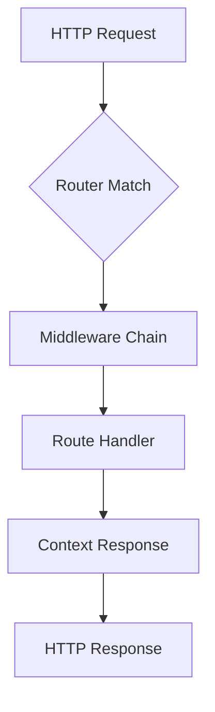

import { Callout } from 'fumadocs-ui/components/callout';
import { Tab, Tabs } from 'fumadocs-ui/components/tabs';

# Routing

Axiom provides expressive, type-safe routing through the `Router` class.

## Basic Routes

Routes are defined on a `Router` instance:

```java
Router router = new Router();

router.get("/users", c -> { ... });
router.post("/users", c -> { ... });
router.put("/users/:id", c -> { ... });
router.delete("/users/:id", c -> { ... });
router.patch("/users/:id", c -> { ... });
router.head("/health", c -> { ... });
router.options("/cors", c -> { ... });
```

## Path Parameters

Use `:name` for dynamic segments:

```java
router.get("/users/:id", c -> {
    String id = c.param("id");
    c.json(userService.findById(id));
});

router.get("/users/:userId/posts/:postId", c -> {
    String userId = c.param("userId");
    String postId = c.param("postId");
    // ...
});
```

## Wildcard Routes

Use `*` to match anything:

```java
// Matches /files/a, /files/a/b/c, etc.
router.get("/files/*", c -> {
    String path = c.param("*");
    c.text("Path: " + path);
});
```

## Route Groups

Organize routes with common prefixes using `group()`:

```java
Router router = new Router();

router.group("/api/v1", api -> {
    api.get("/users", userHandler::list);
    api.post("/users", userHandler::create);

    api.group("/admin", admin -> {
        admin.get("/stats", adminHandler::stats);
        admin.delete("/users/:id", adminHandler::deleteUser);
    });
});
```

This creates:
- `GET /api/v1/users`
- `POST /api/v1/users`
- `GET /api/v1/admin/stats`
- `DELETE /api/v1/admin/users/:id`

## Query Parameters

```java
router.get("/search", c -> {
    // Get query parameter (returns null if not present)
    String query = c.query("q");

    // Use with default values
    String page = c.query("page");
    int pageNum = page != null ? Integer.parseInt(page) : 1;

    c.json(searchService.search(query, pageNum));
});
```

## Request Body

```java
// Parsed as a record/class
router.post("/users", c -> {
    CreateUserRequest req = c.body(CreateUserRequest.class);
    User user = userService.create(req);
    c.status(201);
    c.json(user);
});

// Schemaless - as Map (Koa/Express style)
router.post("/dynamic", c -> {
    Map<String, Object> body = c.bodyAsMap();
    String name = (String) body.get("name");
    c.json(Map.of("received", name));
});

// Raw string
router.post("/webhook", c -> {
    String raw = c.bodyRaw();
    // process webhook
    c.text("OK");
});

record CreateUserRequest(String name, String email) {}
```

## Response Types

```java
// Plain text
c.text("Hello");

// JSON (auto-serialized)
c.json(Map.of("message", "Hello"));
c.json(new User("1", "John"));

// Status codes
c.status(201);
c.json(created);

c.status(404);
c.text("Not found");

// Headers
c.header("X-Custom", "value");
c.json(data);
```

## Request Headers

```java
router.get("/info", c -> {
    // Get all headers
    Map<String, String> headers = c.headers();

    // Get specific header
    String contentType = c.header("Content-Type");
    String auth = c.header("Authorization");

    c.json(Map.of("userAgent", c.header("User-Agent")));
});
```

## Request Flow Diagram



## Method Reference Handlers

Use method references for cleaner code:

```java
public class UserHandler {
    private final UserService userService;

    public UserHandler(UserService userService) {
        this.userService = userService;
    }

    public void list(Context c) throws Exception {
        c.json(userService.findAll());
    }

    public void create(Context c) throws Exception {
        var req = c.body(CreateUserRequest.class);
        var user = userService.create(req);
        c.status(201);
        c.json(user);
    }

    public void findById(Context c) throws Exception {
        var id = c.param("id");
        userService.findById(id)
            .ifPresentOrElse(
                c::json,
                () -> {
                    c.status(404);
                    c.json(Map.of("error", "Not found"));
                }
            );
    }
}

// In main
var userHandler = new UserHandler(userService);

Router router = new Router();
router.get("/users", userHandler::list);
router.post("/users", userHandler::create);
router.get("/users/:id", userHandler::findById);
```

## Router Merging

Merge routes from other routers:

```java
// Create separate routers for different domains
Router userRoutes = new Router();
userRoutes.get("/", userHandler::list);
userRoutes.post("/", userHandler::create);
userRoutes.get("/:id", userHandler::findById);

Router productRoutes = new Router();
productRoutes.get("/", productHandler::list);
productRoutes.get("/:id", productHandler::findById);

// Merge with prefixes
Router main = new Router();
main.merge("/users", userRoutes);
main.merge("/products", productRoutes);

Axiom.start(main, 8080);
```

## Router-Level Middleware

Apply middleware to all routes in a router:

```java
Router apiRouter = new Router();

// This middleware applies to all routes in this router
apiRouter.use((ctx, next) -> {
    String token = ctx.header("Authorization");
    if (token == null) {
        ctx.status(401);
        ctx.json(Map.of("error", "Unauthorized"));
        return;
    }
    next.run();
});

apiRouter.get("/me", c -> c.json(getCurrentUser()));
apiRouter.get("/settings", c -> c.json(getSettings()));
```

## Connecting Router to App

Routes are connected to the application via `app.route()`:

```java
Router router = new Router();
router.get("/health", c -> c.text("OK"));
router.get("/users", userHandler::list);

App app = Axiom.create();
app.route(router);                           // Mount at root
app.route("/api/v1", apiRouter);             // Mount with prefix
app.route(() -> createDynamicRouter());      // Lazy initialization
app.listen(8080);
```

<Callout type="info">
The `Router` handles route registration and matching. The `App` handles middleware, lifecycle, and error handling.
</Callout>
