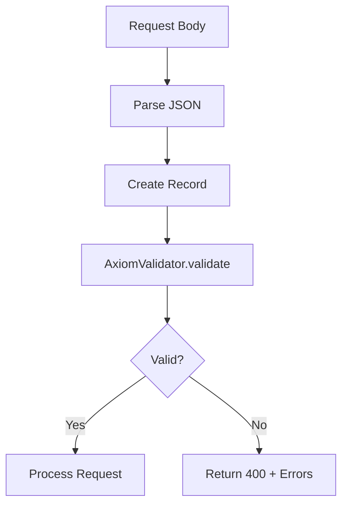

import { Callout } from 'fumadocs-ui/components/callout';
import { Tab, Tabs } from 'fumadocs-ui/components/tabs';

# Validation

Axiom includes built-in validation using Jakarta Bean Validation (JSR-380).

## Basic Usage

```java
import jakarta.validation.constraints.*;

record CreateUserRequest(
    @NotBlank(message = "Username is required")
    @Size(min = 3, max = 50, message = "Username must be 3-50 characters")
    String username,

    @NotBlank(message = "Email is required")
    @Email(message = "Invalid email format")
    String email,

    @NotNull(message = "Age is required")
    @Min(value = 18, message = "Must be at least 18")
    Integer age
) {}
```

## Validating in Handlers

<Tabs items={['Result-Based', 'Throw-Based']}>
  <Tab value="Result-Based">
Handle validation results explicitly:

```java
import io.axiom.validation.AxiomValidator;
import io.axiom.validation.ValidationResult;

router.post("/users", ctx -> {
    CreateUserRequest req = ctx.body(CreateUserRequest.class);

    ValidationResult<CreateUserRequest> result = AxiomValidator.validate(req);

    if (!result.isValid()) {
        ctx.status(400);
        ctx.json(Map.of(
            "error", "Validation failed",
            "details", result.errors()
        ));
        return;
    }

    // Proceed with valid data
    User user = userService.create(result.value());
    ctx.status(201);
    ctx.json(user);
});
```
  </Tab>
  <Tab value="Throw-Based">
Validate and throw exception on failure:

```java
import io.axiom.validation.AxiomValidator;

router.post("/users", ctx -> {
    CreateUserRequest req = ctx.body(CreateUserRequest.class);

    // Throws ValidationException if invalid
    CreateUserRequest validReq = AxiomValidator.validateOrThrow(req);

    User user = userService.create(validReq);
    ctx.status(201);
    ctx.json(user);
});
```
  </Tab>
</Tabs>

## Quick Validity Check

For simple checks without detailed errors:

```java
if (AxiomValidator.isValid(request)) {
    // proceed
} else {
    ctx.status(400);
    ctx.text("Invalid request");
}
```

## Validating Single Properties

Validate specific fields only:

```java
ValidationResult<User> result = AxiomValidator.validateProperty(user, "email");

if (!result.isValid()) {
    System.out.println("Email validation failed: " + result.errors());
}
```

## Common Constraints

| Annotation | Description |
|------------|-------------|
| `@NotNull` | Must not be null |
| `@NotBlank` | String must not be null or empty |
| `@NotEmpty` | Collection/String must not be empty |
| `@Size(min, max)` | Size must be between min and max |
| `@Min(value)` | Number must be at least value |
| `@Max(value)` | Number must be at most value |
| `@Email` | Must be valid email format |
| `@Pattern(regexp)` | Must match regex pattern |
| `@Past` | Date must be in the past |
| `@Future` | Date must be in the future |
| `@Positive` | Number must be positive |
| `@Negative` | Number must be negative |

## Nested Validation

```java
record Order(
    @NotNull @Valid
    Customer customer,

    @NotEmpty @Valid
    List<OrderItem> items
) {}

record Customer(
    @NotBlank String name,
    @Email String email
) {}

record OrderItem(
    @NotBlank String productId,
    @Positive int quantity
) {}
```

<Callout type="info">
Use `@Valid` to trigger validation of nested objects. Without it, nested objects are not validated.
</Callout>

## ValidationResult Sealed Interface

`ValidationResult<T>` is a sealed interface with two variants:

```java
sealed interface ValidationResult<T> permits Valid, Invalid {
    boolean isValid();
    T value();
    List<ValidationError> errors();
    T getOrThrow() throws ValidationException;
}

// Valid result
record Valid<T>(T value) implements ValidationResult<T> { }

// Invalid result
record Invalid<T>(T value, List<ValidationError> errors) implements ValidationResult<T> { }
```

Use pattern matching for clean handling:

```java
ValidationResult<User> result = AxiomValidator.validate(user);

switch (result) {
    case ValidationResult.Valid<User>(var validUser) -> processUser(validUser);
    case ValidationResult.Invalid<User>(var _, var errors) -> {
        ctx.status(400);
        ctx.json(errors);
    }
}
```

## ValidationError Record

Each error contains field path, message, and invalid value:

```java
record ValidationError(
    String path,       // e.g., "email", "address.city", "items[0].name"
    String message,    // e.g., "must be a valid email address"
    Object invalidValue // the actual invalid value
) {}
```

## Custom Validators

```java
@Target({FIELD, PARAMETER})
@Retention(RUNTIME)
@Constraint(validatedBy = PhoneNumberValidator.class)
public @interface PhoneNumber {
    String message() default "Invalid phone number";
    Class<?>[] groups() default {};
    Class<? extends Payload>[] payload() default {};
}

public class PhoneNumberValidator
    implements ConstraintValidator<PhoneNumber, String> {

    private static final Pattern PHONE_PATTERN =
        Pattern.compile("^\\+?[1-9]\\d{1,14}$");

    @Override
    public boolean isValid(String value, ConstraintValidatorContext ctx) {
        if (value == null) return true; // Use @NotNull for null check
        return PHONE_PATTERN.matcher(value).matches();
    }
}

// Usage
record ContactInfo(
    @NotBlank String name,
    @PhoneNumber String phone
) {}
```

## Validation Flow



## Error Response Format

```json
{
    "error": "Validation failed",
    "details": [
        {
            "path": "username",
            "message": "Username is required",
            "invalidValue": ""
        },
        {
            "path": "email",
            "message": "Invalid email format",
            "invalidValue": "not-an-email"
        }
    ]
}
```

## Global Validation Error Handler

Handle `ValidationException` globally with `app.onError()`:

```java
App app = Axiom.create();

app.onError((ctx, e) -> {
    if (e instanceof ValidationException ve) {
        ctx.status(400);
        ctx.json(Map.of(
            "error", "Validation failed",
            "details", ve.getErrors()
        ));
    } else {
        ctx.status(500);
        ctx.json(Map.of("error", e.getMessage()));
    }
});
```

## Complete Example

```java title="App.java"
import io.axiom.core.app.*;
import io.axiom.core.routing.Router;
import io.axiom.validation.*;
import jakarta.validation.constraints.*;
import java.util.Map;

public class App {
    public static void main(String[] args) {
        Router router = new Router();

        router.post("/users", ctx -> {
            var req = ctx.body(CreateUserRequest.class);
            var validReq = AxiomValidator.validateOrThrow(req);

            var user = userService.create(validReq);
            ctx.status(201);
            ctx.json(user);
        });

        App app = Axiom.create();

        // Global validation error handler
        app.onError((ctx, e) -> {
            if (e instanceof ValidationException ve) {
                ctx.status(400);
                ctx.json(Map.of(
                    "error", "Validation failed",
                    "details", ve.getErrors()
                ));
            } else {
                ctx.status(500);
                ctx.json(Map.of("error", e.getMessage()));
            }
        });

        app.route(router);
        app.listen(8080);
    }
}

record CreateUserRequest(
    @NotBlank @Size(min = 3, max = 50)
    String username,

    @NotBlank @Email
    String email,

    @NotNull @Min(18)
    Integer age
) {}
```
